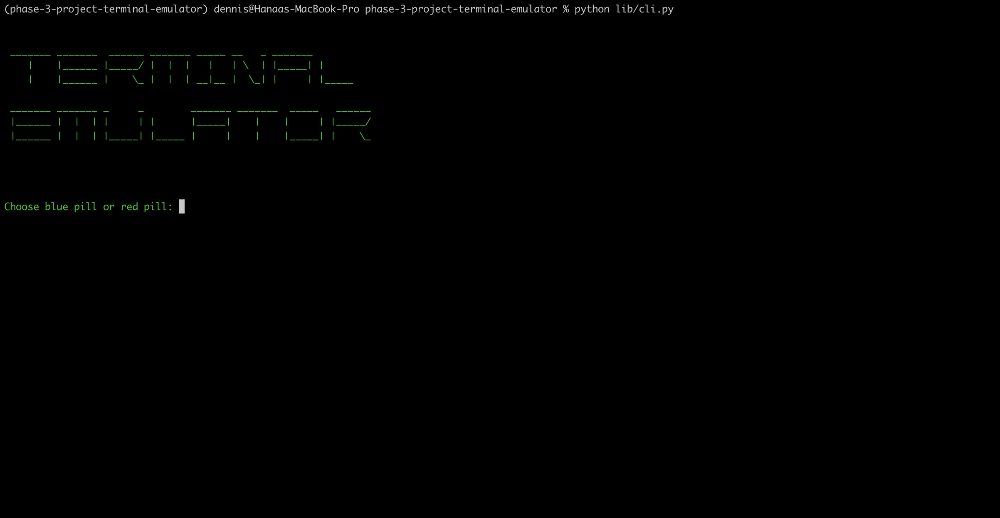
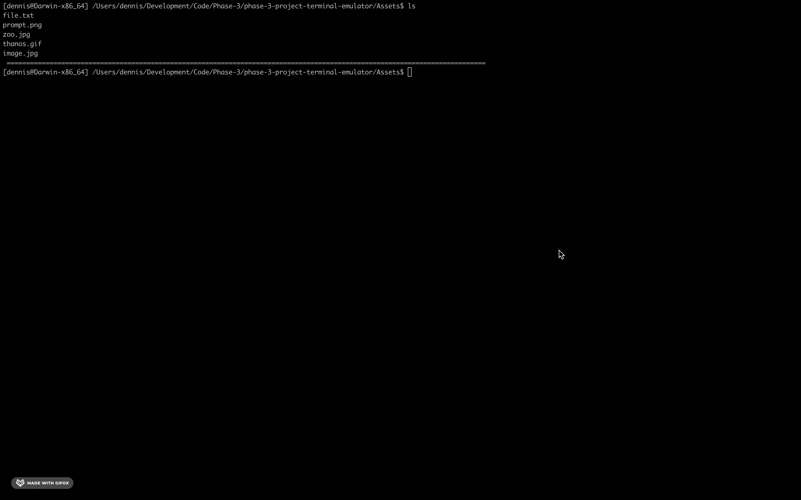

# Terminal Emulator

## Project Description
This project aims to emulate the bash terminal functionality (and more!), primarily through the use of python's OS module.  

## Installation 
To run this application, please take the following steps: 
1. Fork and clone the following repositiory to your local machine:
    https://github.com/maiyuzhe/phase-3-project-terminal-emulator/tree/main
2. Cd into the directory you cloned the repository into
3. Run: 
    ```
    pipenv install 
    pipenv shell 
    pip install pyautogui
    brew install viu
    ```
4. To start the python script: 
    ```
     python(3) lib/cli.py
    ```
5. After running the prompt you will be given a prompt:

    

    Enter blue pill (no quotes) to stay within the emulator.  Enter red pill for a surprise!
    ***Note: entering red pill at the prompt will end the program***

6. You are now inside of an emulated terminal (within your own terminal).  Enter commands to try it out (i.e. cd, ls, mkdir, open)

## Commands
1. cd (change directory)
2. cd .. (navigate to parent directory)
3. ls (list files and directories)
4. mkdir (create new directory)
5. open (open file -- no quotes)
***If entered file is in db, it will open in browser.  If file is within current directory (but not db), it will open the file using your local machines default***
6. remove (remove specified directory, no quotes)
7. touch 
***will create a file in a sqlalchemy database***
8. diplay (custom feature)
    ### Display Demo
    

    ### NOTE 
    ***For optimal usage of the display feature, install iTerm2 and viu:*** 
    https://iterm2.com/downloads.html
    https://github.com/atanunq/viu/blob/master/README.md
    
    ***This is a terminal application that allows for seamless display of images within the terminal. Using your system's built in terminal may cause issues with image rendering.***
9. clear (clear the terminal)

## Resources 

### Modules and Packages 
##### OS Module
https://docs.python.org/3/library/os.html
##### Time Module 
https://docs.python.org/3/library/time.html
##### Webbrowser Module 
https://docs.python.org/3/library/webbrowser.html
##### Pyautogui Package
https://pyautogui.readthedocs.io/en/latest/

### Styling
##### Title Text
https://patorjk.com/software/taag/#p=display&f=Graffiti&t=Type%20Something%20
##### Colors
https://ss64.com/nt/syntax-ansi.html
##### Matrix Animation
https://pythondex.com/matrix-effect-in-python

### Terminal 
https://iterm2.com/documentation.html

### Display
https://github.com/atanunq/viu/blob/master/README.md

##### **Note:**

***For this project, we used ``` brew install viu ``` as it is running on MacOs. For instillation in other operating systems refer to viu documentation using the link above ^***

## Contributors
Dennis Farley | https://github.com/dfarlz97

Michael Maurer | https://github.com/maiyuzhe

